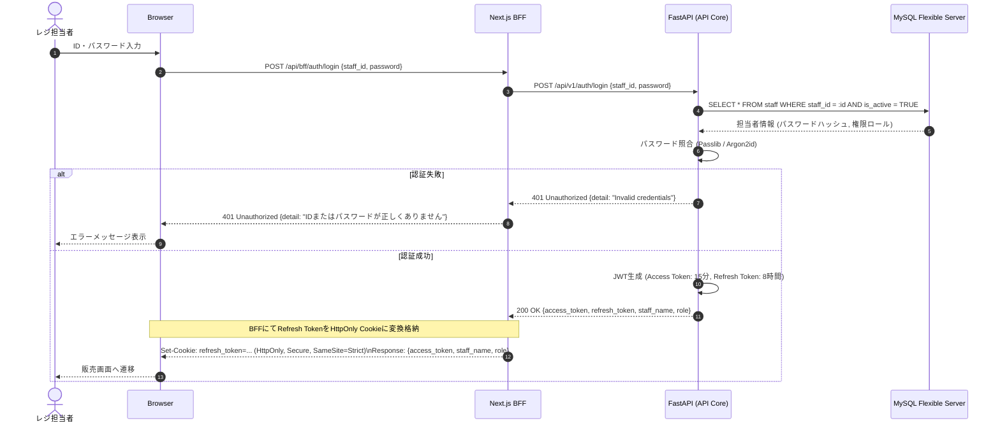
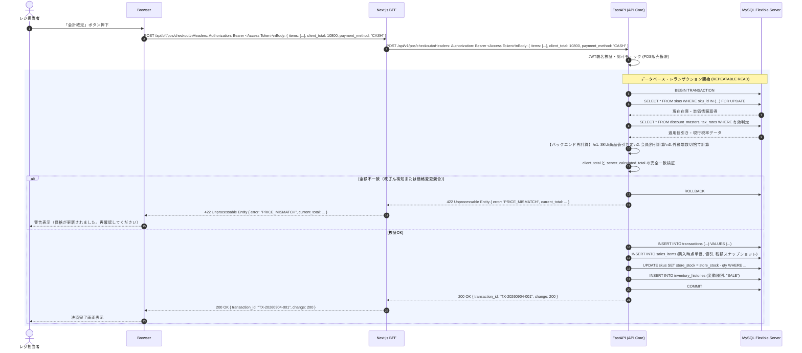
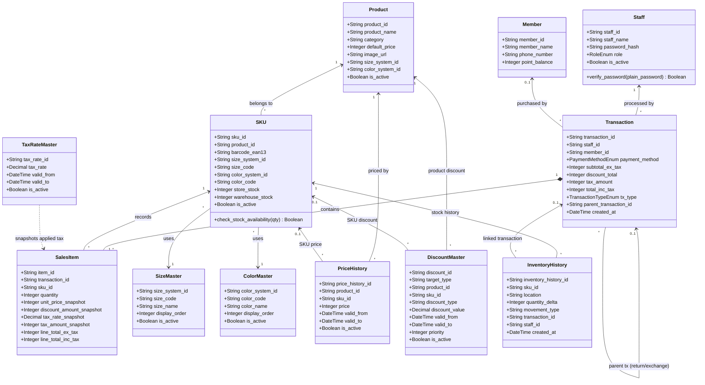

# アパレル POSアプリ 基本・詳細設計仕様書（Lv3対応・セキュリティ強化版）

- **文書バージョン**：v1.5.1
- **作成日**：2026年9月
- **改訂内容（v1.5.1）**：
  - `products` / `skus` テーブルに `is_active` フラグを追加（4.2節）。運用方針「マスターテーブルは物理削除せず `is_active` で論理無効化する」（4.1節）が `staff`/`size_masters`/`color_masters` 等には反映済みだったが、商品マスター本体に欠落していたための追補。あわせてクラス図（2.4節）にも反映
- **改訂内容（v1.5）**：
  - SKUテーブルの外部キー（Size/Color Master）および複合キー参照の厳密化
  - 各種履歴・マスターテーブル（PriceHistory, DiscountMaster, InventoryHistory）へのSKU/Product等外部キー制約の追加
  - 返品・交換用自己参照外部キー（Transaction `parent_transaction_id`）の追加
  - クラス図における `TaxRateMaster` のリレーションを `SalesItem` のスナップショットへ修正
  - アクティビティ図におけるBFF経由（Frontend → BFF → Backend）の明確化
  - CORS制御とサーバー間内部通信（BFF → FastAPI）の切り分け記述の適正化
  - セキュリティ用語「ゼロトラストの考え方を取り入れた」へのトーン調整
- **対象アーキテクチャ**：Next.js (TypeScript) + FastAPI (Python) + Azure Database for MySQL Flexible Server

---

## 1. システムアーキテクチャ概要

### 1.1 全体ネットワーク＆通信構成（BFF・リバースプロキシ構成）
クライアント端末（ブラウザ）からバックエンドAPIサーバー（FastAPI）へ直接アクセスさせず、Next.jsのAPI Routes（BFF: Backend For Frontend）を経由させるリバースプロキシ設計を採用する。
これにより、バックエンドURLの外部秘匿、CORS制御の極小化、Cookieの安全なハンドリングを実現する。

```
[クライアント端末 (カメラ付き)]
   │ HTTPS (443)
   ▼
[Next.js (BFF / Frontend)]  ─── (リバースプロキシ / 内部ルーティング)
   │
   │ 内部ネットワーク (Azure VNet / プライベート通信)
   ▼
[FastAPI (Backend API)]
   │
   │ SQLAlchemy ORM (TLS/SSL暗号化接続)
   ▼
[Azure Database for MySQL Flexible Server]
```

---

## 2. UML 設計図

### 2.1 ユースケース図（Lv3 権限別アクター対応）
一般スタッフ、店長、システム管理者の3アクターによるロールベースの権限境界を定義する。

```mermaid
usecaseDiagram
actor "一般スタッフ" as Staff
actor "店長" as StoreManager
actor "システム管理者" as Admin

StoreManager --|> Staff
Admin --|> StoreManager

package "アパレル POSシステム" {
  usecase "UC01: 担当者ログイン/ログアウト" as UC01
  usecase "UC02: バーコードスキャン販売・手入力" as UC02
  usecase "UC03: 会員読取・特典適用" as UC03
  usecase "UC04: 会計決済・売上確定" as UC04
  usecase "UC05: 返品・交換受付（照合判定）" as UC05
  usecase "UC06: 在庫照会・入荷登録" as UC06
  
  usecase "UC07: 店舗間在庫移動" as UC07
  usecase "UC08: 会員情報編集" as UC08
  usecase "UC09: 商品マスター管理" as UC09
  usecase "UC10: 値引きマスター管理" as UC10

  usecase "UC11: 税率マスター改定" as UC11
  usecase "UC12: スタッフアカウント・権限管理" as UC12
  usecase "UC13: 監査ログ・全社売上閲覧" as UC13
}

Staff --> UC01
Staff --> UC02
Staff --> UC03
Staff --> UC04
Staff --> UC05
Staff --> UC06

StoreManager --> UC07
StoreManager --> UC08
StoreManager --> UC09
StoreManager --> UC10

Admin --> UC11
Admin --> UC12
Admin --> UC13
```

---

### 2.2 アクティビティ図（会計・二重計算検証・決済フロー）
フロントエンドとバックエンドの**二重計算・改ざん検知ロジック**を含めた業務処理フロー。

```mermaid
flowchart TD
    Start([開始: 販売画面]) --> Scan[カメラでEAN-13スキャン / SKU手入力]
    Scan --> FetchBFF[BFFへ商品情報取得要求]
    FetchBFF --> FetchSKU[FastAPIへ商品情報取得要求]
    FetchSKU --> ReturnSKU[SKU情報取得]
    ReturnSKU --> CheckList{既に購入リストに存在するか?}
    CheckList -- Yes --> AddQty[数量 + 1]
    CheckList -- No --> AddItem[新規SKU追加 (初期数量1)]
    
    AddItem --> InputMember[会員バーコード読取 (任意)]
    AddQty --> InputMember
    
    InputMember --> CalcFEnd[Frontend: 仮小計・値引・消費税計算]
    CalcFEnd --> WaitCheckout[決済ボタン押下]
    
    WaitCheckout --> PostOrder[BFF経由でチェックアウトAPIへ送信\n{明細, FE計算合計額, 決済種別}]
    
    subgraph Backend [FastAPI: 改ざん防止・計算検証トランザクション]
        ValidateToken[JWTトークン・権限検証] --> LockStock[対象SKU行ロック SELECT FOR UPDATE]
        LockStock --> Recalc[Backend: DB最新マスターに基づき再計算\n①SKU/商品値引 → ②金額値引 → ③会員値引 → ④税抜 → ⑤税]
        Recalc --> Compare{FE提示額 == BE再計算額 ?}
        Compare -- 不一致 (改ざん/マスター変更) --> RaiseErr[422 Unprocessable Entity: 金額不整合エラー]
        Compare -- 一致 (検証OK) --> ExecStock[在庫引当 / マイナス更新]
        ExecStock --> SaveSales[取引(Transactions) & 売上明細(SalesItems) 保存\n購入時点のスナップショット記録]
        SaveSales --> CommitTx[DBコミット]
    end

    PostOrder --> ValidateToken
    RaiseErr --> AlertUI[UI上に再計算・警告表示]
    CommitTx --> PrintReceipt[決済完了画面・レシート表示]
    PrintReceipt --> End([終了: 次の取引へ])
```

---

### 2.3 シーケンス図（認証・POSスキャン・決済トランザクション）

#### ① ログイン & JWT発行・HttpOnly Cookie設定（BFF終端）


#### ② 会計確定と二重計算バリデーション（金額改ざん防御）


---

### 2.4 クラス図 / ドメインモデル（ORM & TypeScript連携）
Backend（SQLAlchemy / Pydantic）と Frontend（TypeScript Interface）で型安全性を同期させるドメイン設計。



---

## 3. Webアプリケーション セキュリティ設計仕様

### 3.1 認証・認可設計（JWT & RBAC）
- **アルゴリズム**：`RS256` または `HS256`（強固な32バイト以上のシークレットキー）。
- **トークン設計（二重トークン方式）**：
  - **Access Token**：有効期限 **15分**。ペイロードに `staff_id`, `role`, `exp` を内包。ブラウザのlocalStorage等の永続ストレージには保存せず、メモリ上（React Context / Zustand）で保持する。
  - **Refresh Token**：有効期限 **8時間**（店舗シフト考慮）。BFF層においてブラウザの `HttpOnly`, `Secure`, `SameSite=Strict` Cookieとして管理・終端する。
- **認可制御（RBAC: Role-Based Access Control）**：
  FastAPIの `Depends()` 依存性注入を利用し、エンドポイント単位で権限チェックを実施。

```python
# FastAPI 権限デコレータ実装仕様例
def require_roles(allowed_roles: list[RoleEnum]):
    def role_checker(current_user: Staff = Depends(get_current_active_staff)):
        if current_user.role not in allowed_roles:
            raise HTTPException(
                status_code=status.HTTP_403_FORBIDDEN,
                detail="操作を行う権限がありません。"
            )
        return current_user
    return role_checker
```

---

### 3.2 ログイン試行制限（Rate Limiting）
- ログインAPIには連続試行制限を適用する。
- 同一 `staff_id` について、認証失敗が **5回** 発生した場合、**15分間**ログイン試行を制限する。
- 制限中は `429 Too Many Requests` を返却する。
- IPアドレス単位の制限も併用し、短時間の大量試行を抑止する。
- ログイン失敗時の応答では、アカウント存在の有無を漏洩させないため、一律「IDまたはパスワードが正しくありません」を返却する。

---

### 3.3 通信保護 & BFF・CORS設計
- **BFF（Next.js API Routes / Rewrites）の役割**：
  - 端末ブラウザからは同一オリジン（`https://pos.company.internal/api/bff/...`）としてアクセス。
  - Next.js サーバーがバックエンド（`https://fastapi.internal:8000/...`）へ内部通信でフォワード。
  - クライアント側にFastAPIの物理ドメイン・IPを一切露出させない。
- **CORS・通信制限（FastAPI側）**：
  - FastAPIはBFFからの内部通信を前提とする。ブラウザからFastAPIへの直接アクセスは原則許可しない。
  - 特殊な要件でCORSを使用する場合、許可するブラウザオリジンを明示的にホワイトリスト登録する（本番環境での `*` は完全禁止）。

```python
from fastapi.middleware.cors import CORSMiddleware

app.add_middleware(
    CORSMiddleware,
    allow_origins=["https://pos.company.internal"], # BFFまたは正当なフロントエンドオリジンに限定
    allow_credentials=True,
    allow_methods=["GET", "POST", "PUT", "DELETE"],
    allow_headers=["Authorization", "Content-Type", "X-Requested-With"],
)
```

---

### 3.4 計算値改ざん防止（Backend二重バリデーション）
- **脆弱性対策**：フロントエンドのJavaScriptはブラウザ開発者ツール等で書き換え可能。
- **ゼロトラストの考え方を取り入れた防御仕様**：
  1. クライアントから送信される「単価」「値引き額」「税率」は信用しない。
  2. クライアントからは `{ sku_id, quantity, client_claimed_total }` のみを送信。
  3. バックエンド側で必ずDB最新マスターから単価・値引き・税率を引き直し、四則演算および外税端数処理（切捨て）を再実行する。
  4. `client_claimed_total != server_calculated_total` の場合は即時 `422 Unprocessable Entity` を返却し、トランザクションを中断する。

---

### 3.5 API定義書の非表示（Swagger Docs 無効化）
FastAPI標準の `/docs` (Swagger UI) および `/redoc` は、本番環境において無効化しスキーマ漏洩を防止する。

```python
import os
from fastapi import FastAPI

ENV = os.getenv("ENVIRONMENT", "production")

app = FastAPI(
    title="Apparel POS API",
    docs_url="/docs" if ENV == "development" else None,
    redoc_url="/redoc" if ENV == "development" else None,
    openapi_url="/openapi.json" if ENV == "development" else None,
)
```

---

### 3.6 SQLインジェクション完全防御（型定義 ＆ ORM）
フロントからDB層まで全レイヤーで静的型チェックとプリペアドステートメントを徹底する。

1. **Frontend (TypeScript)**：
   入力値の型（文字列・数値・EAN-13形式）を厳密に制限。不正なスクリプト文字列等の混入を事前抑止。
   ```typescript
   export interface CheckoutItemRequest {
     sku_id: string; // SKU ID (英数字フォーマット)
     quantity: number; // 1 <= quantity <= 99
   }
   ```
2. **Backend (Pydantic & SQLAlchemy ORM)**：
   - 生のSQL文字列結合をコード規約で完全禁止。
   - すべて SQLAlchemy のクエリビルダー / ORM マッピングを使用し、DBドライバレベルでプレースホルダーによるエスケープを強制。
   ```python
   # パラメータ化クエリによる安全な照会
   stmt = select(SKU).where(SKU.barcode_ean13 == barcode).limit(1)
   result = await session.execute(stmt)
   ```

---

## 4. データベース物理設計（Azure MySQL Flexible Server）

### 4.1 整合性担保方針（外部キー制約）
- 過去取引データのスナップショット性およびデータ整合性を両立するため、取引明細・SKU等の主要リレーションには **物理外部キー制約（InnoDB Foreign Key）** を設定する。
- 過去の取引データ保持を最優先とするため、マスターテーブル（商品・SKU）は物理削除を禁止し、`is_active` フラグによる論理無効化で運用する（`ON DELETE RESTRICT` を設定）。

### 4.2 テーブル定義 DDL

```sql
-- 1. スタッフテーブル
CREATE TABLE staff (
    staff_id VARCHAR(32) PRIMARY KEY,
    staff_name VARCHAR(64) NOT NULL,
    password_hash VARCHAR(255) NOT NULL,
    role ENUM('STAFF', 'MANAGER', 'ADMIN') NOT NULL DEFAULT 'STAFF',
    is_active BOOLEAN NOT NULL DEFAULT TRUE,
    created_at DATETIME NOT NULL DEFAULT CURRENT_TIMESTAMP,
    updated_at DATETIME NOT NULL DEFAULT CURRENT_TIMESTAMP ON UPDATE CURRENT_TIMESTAMP
) ENGINE=InnoDB DEFAULT CHARSET=utf8mb4 COLLATE=utf8mb4_bin;

-- 2. サイズマスター
CREATE TABLE size_masters (
    size_system_id VARCHAR(32) NOT NULL,
    size_code VARCHAR(16) NOT NULL,
    size_name VARCHAR(32) NOT NULL,
    display_order INT NOT NULL DEFAULT 0,
    is_active BOOLEAN NOT NULL DEFAULT TRUE,
    PRIMARY KEY (size_system_id, size_code)
) ENGINE=InnoDB DEFAULT CHARSET=utf8mb4 COLLATE=utf8mb4_bin;

-- 3. カラーマスター
CREATE TABLE color_masters (
    color_system_id VARCHAR(32) NOT NULL,
    color_code VARCHAR(16) NOT NULL,
    color_name VARCHAR(64) NOT NULL,
    display_order INT NOT NULL DEFAULT 0,
    is_active BOOLEAN NOT NULL DEFAULT TRUE,
    PRIMARY KEY (color_system_id, color_code)
) ENGINE=InnoDB DEFAULT CHARSET=utf8mb4 COLLATE=utf8mb4_bin;

-- 4. 商品マスター
CREATE TABLE products (
    product_id VARCHAR(32) PRIMARY KEY,
    product_name VARCHAR(128) NOT NULL,
    category VARCHAR(64) NOT NULL,
    default_price INT NOT NULL,
    image_url VARCHAR(512),
    size_system_id VARCHAR(32),
    color_system_id VARCHAR(32),
    is_active BOOLEAN NOT NULL DEFAULT TRUE,
    created_at DATETIME NOT NULL DEFAULT CURRENT_TIMESTAMP,
    updated_at DATETIME NOT NULL DEFAULT CURRENT_TIMESTAMP ON UPDATE CURRENT_TIMESTAMP
) ENGINE=InnoDB DEFAULT CHARSET=utf8mb4 COLLATE=utf8mb4_bin;

-- 5. SKUテーブル (EAN-13一意性制約)
CREATE TABLE skus (
    sku_id VARCHAR(64) PRIMARY KEY,
    product_id VARCHAR(32) NOT NULL,
    barcode_ean13 VARCHAR(13) NOT NULL UNIQUE,
    size_system_id VARCHAR(32) NOT NULL,
    size_code VARCHAR(16) NOT NULL,
    color_system_id VARCHAR(32) NOT NULL,
    color_code VARCHAR(16) NOT NULL,
    store_stock INT NOT NULL DEFAULT 0,
    warehouse_stock INT NOT NULL DEFAULT 0,
    location VARCHAR(32),
    is_active BOOLEAN NOT NULL DEFAULT TRUE,
    created_at DATETIME NOT NULL DEFAULT CURRENT_TIMESTAMP,
    INDEX idx_product (product_id),
    CONSTRAINT fk_sku_product FOREIGN KEY (product_id) REFERENCES products(product_id) ON DELETE RESTRICT,
    CONSTRAINT fk_sku_size FOREIGN KEY (size_system_id, size_code) REFERENCES size_masters(size_system_id, size_code) ON DELETE RESTRICT,
    CONSTRAINT fk_sku_color FOREIGN KEY (color_system_id, color_code) REFERENCES color_masters(color_system_id, color_code) ON DELETE RESTRICT,
    CONSTRAINT chk_stock CHECK (store_stock >= 0)
) ENGINE=InnoDB DEFAULT CHARSET=utf8mb4 COLLATE=utf8mb4_bin;

-- 6. 会員テーブル
CREATE TABLE members (
    member_id VARCHAR(32) PRIMARY KEY,
    member_name VARCHAR(128) NOT NULL,
    phone_number VARCHAR(32),
    address VARCHAR(255),
    gender VARCHAR(16),
    age INT,
    point_balance INT NOT NULL DEFAULT 0,
    created_at DATETIME NOT NULL DEFAULT CURRENT_TIMESTAMP,
    updated_at DATETIME NOT NULL DEFAULT CURRENT_TIMESTAMP ON UPDATE CURRENT_TIMESTAMP
) ENGINE=InnoDB DEFAULT CHARSET=utf8mb4 COLLATE=utf8mb4_bin;

-- 7. 取引テーブル (Transaction)
CREATE TABLE transactions (
    transaction_id VARCHAR(64) PRIMARY KEY,
    member_id VARCHAR(32) NULL,
    staff_id VARCHAR(32) NOT NULL,
    payment_method ENUM('CASH', 'CREDIT_CARD', 'QR_CODE', 'IC') NOT NULL,
    subtotal_ex_tax INT NOT NULL,
    discount_total INT NOT NULL DEFAULT 0,
    tax_amount INT NOT NULL,
    total_inc_tax INT NOT NULL,
    tx_type ENUM('SALE', 'RETURN', 'EXCHANGE') NOT NULL DEFAULT 'SALE',
    parent_transaction_id VARCHAR(64) NULL, -- 返品・交換時の元取引ID
    created_at DATETIME NOT NULL DEFAULT CURRENT_TIMESTAMP,
    INDEX idx_created (created_at),
    INDEX idx_member (member_id),
    CONSTRAINT fk_tx_staff FOREIGN KEY (staff_id) REFERENCES staff(staff_id) ON DELETE RESTRICT,
    CONSTRAINT fk_tx_member FOREIGN KEY (member_id) REFERENCES members(member_id) ON DELETE RESTRICT,
    CONSTRAINT fk_tx_parent FOREIGN KEY (parent_transaction_id) REFERENCES transactions(transaction_id) ON DELETE RESTRICT
) ENGINE=InnoDB DEFAULT CHARSET=utf8mb4 COLLATE=utf8mb4_bin;

-- 8. 売上明細テーブル (購入時点のスナップショット保持)
CREATE TABLE sales_items (
    item_id BIGINT AUTO_INCREMENT PRIMARY KEY,
    transaction_id VARCHAR(64) NOT NULL,
    sku_id VARCHAR(64) NOT NULL,
    product_id VARCHAR(32) NOT NULL,
    quantity INT NOT NULL,
    unit_price_snapshot INT NOT NULL, -- 取引時点の単価
    discount_amount_snapshot INT NOT NULL DEFAULT 0, -- 取引時点の値引
    tax_rate_snapshot DECIMAL(5, 2) NOT NULL, -- 例: 10.00
    tax_amount_snapshot INT NOT NULL,
    line_total_ex_tax INT NOT NULL,
    line_total_inc_tax INT NOT NULL,
    CONSTRAINT fk_item_tx FOREIGN KEY (transaction_id) REFERENCES transactions(transaction_id) ON DELETE RESTRICT,
    CONSTRAINT fk_item_sku FOREIGN KEY (sku_id) REFERENCES skus(sku_id) ON DELETE RESTRICT,
    CONSTRAINT fk_item_prod FOREIGN KEY (product_id) REFERENCES products(product_id) ON DELETE RESTRICT
) ENGINE=InnoDB DEFAULT CHARSET=utf8mb4 COLLATE=utf8mb4_bin;

-- 9. 単価履歴
CREATE TABLE price_histories (
    price_history_id VARCHAR(64) PRIMARY KEY,
    product_id VARCHAR(32) NOT NULL,
    sku_id VARCHAR(64) NULL,
    price INT NOT NULL,
    valid_from DATETIME NOT NULL,
    valid_to DATETIME NULL,
    is_active BOOLEAN NOT NULL DEFAULT TRUE,
    INDEX idx_price_target (product_id, sku_id, valid_from, valid_to),
    CONSTRAINT fk_price_prod FOREIGN KEY (product_id) REFERENCES products(product_id) ON DELETE RESTRICT,
    CONSTRAINT fk_price_sku FOREIGN KEY (sku_id) REFERENCES skus(sku_id) ON DELETE RESTRICT
) ENGINE=InnoDB DEFAULT CHARSET=utf8mb4 COLLATE=utf8mb4_bin;

-- 10. 値引きマスター
CREATE TABLE discount_masters (
    discount_id VARCHAR(64) PRIMARY KEY,
    target_type ENUM('SKU', 'PRODUCT', 'MEMBER') NOT NULL,
    product_id VARCHAR(32) NULL,
    sku_id VARCHAR(64) NULL,
    discount_type ENUM('RATE', 'AMOUNT') NOT NULL,
    discount_value DECIMAL(10,2) NOT NULL,
    valid_from DATETIME NOT NULL,
    valid_to DATETIME NULL,
    priority INT NOT NULL,
    is_active BOOLEAN NOT NULL DEFAULT TRUE,
    INDEX idx_discount_target (target_type, product_id, sku_id, valid_from, valid_to),
    CONSTRAINT fk_discount_product FOREIGN KEY (product_id) REFERENCES products(product_id) ON DELETE RESTRICT,
    CONSTRAINT fk_discount_sku FOREIGN KEY (sku_id) REFERENCES skus(sku_id) ON DELETE RESTRICT
) ENGINE=InnoDB DEFAULT CHARSET=utf8mb4 COLLATE=utf8mb4_bin;

-- 11. 税率マスター
CREATE TABLE tax_rates (
    tax_rate_id VARCHAR(32) PRIMARY KEY,
    tax_rate DECIMAL(5,2) NOT NULL,
    valid_from DATETIME NOT NULL,
    valid_to DATETIME NULL,
    is_active BOOLEAN NOT NULL DEFAULT TRUE,
    INDEX idx_tax_validity (valid_from, valid_to)
) ENGINE=InnoDB DEFAULT CHARSET=utf8mb4 COLLATE=utf8mb4_bin;

-- 12. 在庫履歴
CREATE TABLE inventory_histories (
    inventory_history_id BIGINT AUTO_INCREMENT PRIMARY KEY,
    sku_id VARCHAR(64) NOT NULL,
    location VARCHAR(32) NOT NULL,
    quantity_delta INT NOT NULL,
    movement_type ENUM('RECEIPT', 'SALE', 'RETURN', 'TRANSFER', 'ADJUSTMENT') NOT NULL,
    transaction_id VARCHAR(64) NULL,
    staff_id VARCHAR(32) NOT NULL,
    created_at DATETIME NOT NULL DEFAULT CURRENT_TIMESTAMP,
    INDEX idx_inventory_sku_time (sku_id, created_at),
    INDEX idx_inventory_transaction (transaction_id),
    CONSTRAINT fk_inv_sku FOREIGN KEY (sku_id) REFERENCES skus(sku_id) ON DELETE RESTRICT,
    CONSTRAINT fk_inv_staff FOREIGN KEY (staff_id) REFERENCES staff(staff_id) ON DELETE RESTRICT,
    CONSTRAINT fk_inv_transaction FOREIGN KEY (transaction_id) REFERENCES transactions(transaction_id) ON DELETE RESTRICT
) ENGINE=InnoDB DEFAULT CHARSET=utf8mb4 COLLATE=utf8mb4_bin;
```

---

## 5. API エンドポイント設計仕様

### 5.1 BFF ↔ Backend パス転送対応表
クライアント端末（ブラウザ）はBFFエンドポイントを呼び出し、BFFが内部通信によりFastAPIエンドポイントへプロキシ中継を行う。
追加APIを含め、全てのリクエストパスを以下の対応表で一元管理する。

| BFF エンドポイント (Next.js) | バックエンド エンドポイント (FastAPI) | メソッド | 許可ロール | 概要 / セキュリティ要件 |
|---|---|---|---|---|
| `/api/bff/auth/login` | `/api/v1/auth/login` | `POST` | 全員 | 担当者認証。Rate Limiting（5回失敗で15分ロック）適用 |
| `/api/bff/auth/refresh` | `/api/v1/auth/refresh` | `POST` | 全員 | HttpOnly Cookie内Refresh TokenからAccess Token再発行 |
| `/api/bff/skus/barcode/{ean13}` | `/api/v1/skus/barcode/{ean13}` | `GET` | 全スタッフ | バーコード照会。0.5秒以内目標、インデックス必須 |
| `/api/bff/pos/checkout` | `/api/v1/pos/checkout` | `POST` | 全スタッフ | 会計決済トランザクション。**金額二重検証必須** |
| `/api/bff/pos/refund-exchange` | `/api/v1/pos/refund-exchange` | `POST` | 全スタッフ | 返品・交換処理。元取引SKU照合および逆伝票起票 |
| `/api/bff/inventory/transfer` | `/api/v1/inventory/transfer` | `POST` | 店長・管理者 | 店舗間在庫移動の登録 |
| `/api/bff/masters/discounts` | `/api/v1/masters/discounts` | `PUT` | 店長・管理者 | 値引きマスター更新（コード改修なしで反映） |
| `/api/bff/masters/tax-rates` | `/api/v1/masters/tax-rates` | `PUT` | システム管理者 | 税率改定マスター更新 |
| `/api/bff/admin/staff` | `/api/v1/admin/staff` | `POST` | システム管理者 | スタッフアカウント作成・権限変更 |
| `/api/bff/members/{member_id}` | `/api/v1/members/{member_id}` | `GET` | 全スタッフ | 会員情報取得・照会 |
| `/api/bff/members/{member_id}` | `/api/v1/members/{member_id}` | `PUT` | 店長・管理者 | 会員情報編集・更新 |
| `/api/bff/products/{product_id}` | `/api/v1/products/{product_id}` | `GET` | 全スタッフ | 商品詳細情報の取得 |
| `/api/bff/admin/products` | `/api/v1/admin/products` | `POST` | 店長・管理者 | 新規商品の登録 |
| `/api/bff/admin/products/{product_id}`| `/api/v1/admin/products/{product_id}`| `PUT` | 店長・管理者 | 商品マスター情報の更新 |
| `/api/bff/inventory/{sku_id}` | `/api/v1/inventory/{sku_id}` | `GET` | 全スタッフ | 指定SKUの在庫状況照会 |
| `/api/bff/inventory/receipt` | `/api/v1/inventory/receipt` | `POST` | 全スタッフ | 入荷登録（在庫プラス更新） |
| `/api/bff/transactions/{transaction_id}` | `/api/v1/transactions/{transaction_id}`| `GET` | 全スタッフ | 取引詳細・レシート情報の取得 |
| `/api/bff/transactions` | `/api/v1/transactions` | `GET` | 店長・管理者 | 取引一覧の取得・検索 |
| `/api/bff/reports/sales` | `/api/v1/reports/sales` | `GET` | 店長・管理者 | 日次・月次等の売上集計取得 |
| `/api/bff/audit-logs` | `/api/v1/audit-logs` | `GET` | システム管理者| システム監査ログの照会 |

---

## 6. OSS・フレームワーク バージョン管理仕様

実装時点のバージョンを記録し、脆弱性情報と合わせて継続管理する。実際のバージョン番号は実装時のロックファイルを正とする。

| 区分 | ソフトウェア / ライブラリ | 管理方法 |
|---|---|---|
| Frontend | Next.js | package-lock.jsonで固定 |
| Frontend | React / React DOM | package-lock.jsonで固定 |
| Frontend | TypeScript | package-lock.jsonで固定 |
| Backend | Python | 実行環境バージョンを固定 |
| Backend | FastAPI | requirements.txt / lockファイルで固定 |
| Backend | Pydantic | requirements.txt / lockファイルで固定 |
| Backend | SQLAlchemy | requirements.txt / lockファイルで固定 |
| Backend | PyMySQL等DBドライバ | requirements.txt / lockファイルで固定 |
| Database | MySQL Flexible Server | Azure側のサポート対象バージョンを採用 |
| CI/CD | GitHub Actions | ActionのバージョンをSHAまたはメジャーバージョンで管理 |

### 脆弱性確認ルール
1. Pull Request時に `npm audit --audit-level=high` を実行する。
2. Backendでは `pip-audit` または `trivy` を実行する。
3. Dependabot security updatesを有効化する。
4. High/Critical相当の既知脆弱性が検出された場合は、影響評価が完了するまで本番デプロイを原則停止する。
5. 月次で主要OSSのバージョンとCVE情報を確認し、更新要否を記録する。

---

## 7. まとめ・実装推奨事項

1. **ゼロトラストの考え方を取り入れた通信設計**：
   BFF（Next.js）によりFastAPIの物理配置を隠蔽し、フロントエンドからの入力値（特に計算金額・単価）はバックエンド側で一切信用せずに再計算・照合する。
2. **性能・レスポンス（0.5秒目標）**：
   Azure Database for MySQL Flexible Server と FastAPI の間はコネクションプール（SQLAlchemy Pool）を常時維持し、要件にあるコールドスタート遅延を防止する。
3. **継続的なセキュリティ監視**：
   CI/CDパイプラインに `pip-audit` / `npm audit` を組み込み、本番稼働後のサプライチェーン攻撃・脆弱性混入を防止する。

---

## 8. Lv3設計レビュー・実装前チェックリスト

### UML
- [x] ユースケース図：ロール別権限を定義
- [x] アクティビティ図：POS会計・二重計算検証を定義。BFF経由フロー明記
- [x] シーケンス図：Browser → BFF → FastAPI → DB の処理順序を厳密に定義
- [x] クラス図：業務エンティティとマスターを定義。外部キーに沿ったリレーション

### Webセキュリティ
- [x] HTTPS通信必須
- [x] JWT認証（Access Token: 15分, Refresh Token: 8時間）
- [x] RBAC認可
- [x] HttpOnly / Secure / SameSite=Strict Cookie（BFF終端）
- [x] BFF / リバースプロキシ
- [x] CORS制御と内部通信前提の切り分け
- [x] Backend再計算による金額改ざん防止（422ステータス統一）
- [x] Swagger / ReDoc / OpenAPI本番無効化
- [x] SQLAlchemy ORM / パラメータ化クエリ
- [x] TypeScript / Pydanticによる入力型定義
- [x] Rate Limiting（5回失敗で15分ロック）
- [x] OSS脆弱性スキャン（npm audit / pip-audit）
- [x] Dependabot設定

### POS業務 & データ要件
- [x] EAN-13 → SKU一意識別
- [x] SKU数量上限99 / 購入リスト最大100SKU
- [x] 値引き優先順位（SKU > 商品ID > 会員）
- [x] 購入時点単価・値引・税率・税額のスナップショット保存
- [x] 在庫ロック（SELECT FOR UPDATE） / トランザクション制御
- [x] 売上・在庫履歴保存
- [x] 返品・交換時の元取引照合
- [x] 物理外部キー制約（InnoDB Foreign Key）による全データ整合性担保