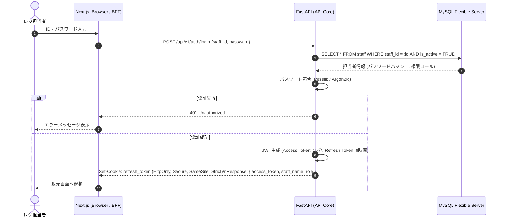
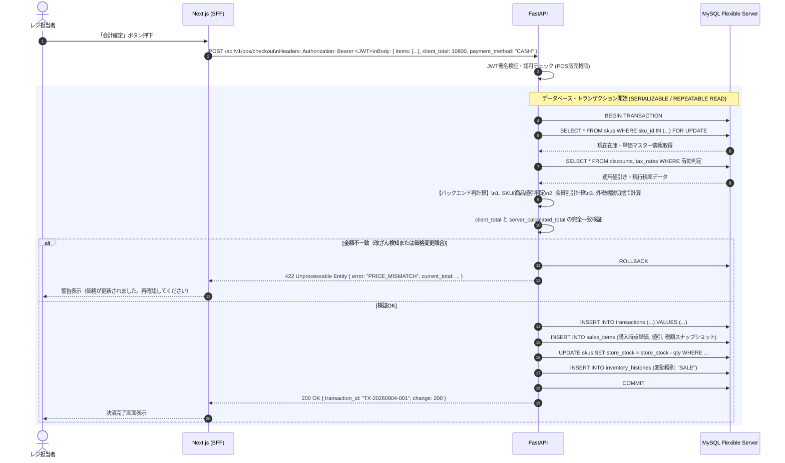
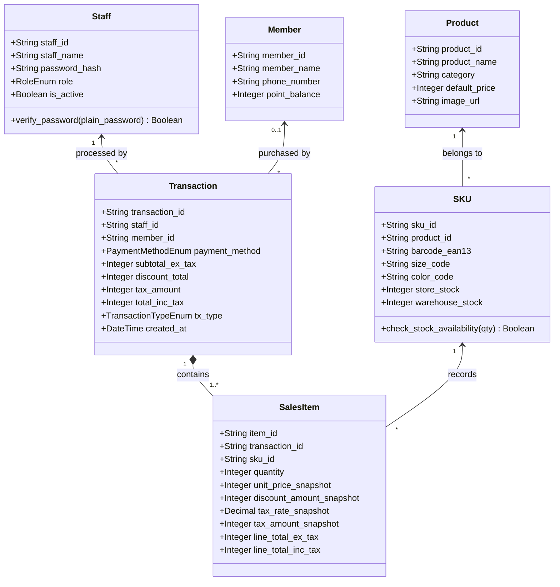

# アパレル POSアプリ 基本・詳細設計仕様書（Lv3対応・セキュリティ強化版）

- **文書バージョン**：v1.0
- **作成日**：2026年9月
- **対象アーキテクチャ**：Next.js (TypeScript) + FastAPI (Python) + Azure Database for MySQL Flexible Server

---

## 1. システムアーキテクチャ概要

### 1.1 全体ネットワーク＆通信構成（BFF・リバースプロキシ構成）
クライアント端末（ブラウザ）からバックエンドAPIサーバー（FastAPI）へ直接アクセスさせず、Next.jsのAPI Routes（BFF: Backend For Frontend）を経由させるリバースプロキシ設計を採用する。
これにより、バックエンドURLの外部秘匿、CORS制御の極小化、Cookieの安全なハンドリングを実現する。

```
[クライアント端末 (カメラ付き)]
   │ HTTPS (443)
   ▼
[Next.js (BFF / Frontend)]  ─── (リバースプロキシ / 内部ルーティング)
   │
   │ 内部ネットワーク (Azure VNet / プライベート通信)
   ▼
[FastAPI (Backend API)]
   │
   │ SQLAlchemy ORM (TLS/SSL暗号化接続)
   ▼
[Azure Database for MySQL Flexible Server]
```

---

## 2. UML 設計図

### 2.1 ユースケース図（Lv3 権限別アクター対応）
一般スタッフ、店長、システム管理者の3アクターによるロールベースの権限境界を定義する。

```mermaid
usecaseDiagram
actor "一般スタッフ" as Staff
actor "店長" as StoreManager
actor "システム管理者" as Admin

StoreManager --|> Staff
Admin --|> StoreManager

package "アパレル POSシステム" {
  usecase "UC01: 担当者ログイン/ログアウト" as UC01
  usecase "UC02: バーコードスキャン販売・手入力" as UC02
  usecase "UC03: 会員読取・特典適用" as UC03
  usecase "UC04: 会計決済・売上確定" as UC04
  usecase "UC05: 返品・交換受付（照合判定）" as UC05
  usecase "UC06: 在庫照会・入荷登録" as UC06
  
  usecase "UC07: 店舗間在庫移動" as UC07
  usecase "UC08: 会員情報編集" as UC08
  usecase "UC09: 商品マスター管理" as UC09
  usecase "UC10: 値引きマスター管理" as UC10

  usecase "UC11: 税率マスター改定" as UC11
  usecase "UC12: スタッフアカウント・権限管理" as UC12
  usecase "UC13: 監査ログ・全社売上閲覧" as UC13
}

Staff --> UC01
Staff --> UC02
Staff --> UC03
Staff --> UC04
Staff --> UC05
Staff --> UC06

StoreManager --> UC07
StoreManager --> UC08
StoreManager --> UC09
StoreManager --> UC10

Admin --> UC11
Admin --> UC12
Admin --> UC13
```

---

### 2.2 アクティビティ図（会計・二重計算検証・決済フロー）
フロントエンドとバックエンドの**二重計算・改ざん検知ロジック**を含めた業務処理フロー。

```mermaid
flowchart TD
    Start([開始: 販売画面]) --> Scan[カメラでEAN-13スキャン / SKU手入力]
    Scan --> FetchSKU[FastAPIへ商品情報取得要求]
    FetchSKU --> CheckList{既に購入リストに存在するか?}
    CheckList -- Yes --> AddQty[数量 + 1]
    CheckList -- No --> AddItem[新規SKU追加 (初期数量1)]
    
    AddItem --> InputMember[会員バーコード読取 (任意)]
    AddQty --> InputMember
    
    InputMember --> CalcFEnd[Frontend: 仮小計・値引・消費税計算]
    CalcFEnd --> WaitCheckout[決済ボタン押下]
    
    WaitCheckout --> PostOrder[BFF経由でチェックアウトAPIへ送信\n{明細, FE計算合計額, 決済種別}]
    
    subgraph Backend [FastAPI: 改ざん防止・計算検証トランザクション]
        ValidateToken[JWTトークン・権限検証] --> LockStock[対象SKU行ロック SELECT FOR UPDATE]
        LockStock --> Recalc[Backend: DB最新マスターに基づき再計算\n①SKU/商品値引 → ②金額値引 → ③会員値引 → ④税抜 → ⑤税]
        Recalc --> Compare{FE提示額 == BE再計算額 ?}
        Compare -- 不一致 (改ざん/マスター変更) --> RaiseErr[400 Bad Request: 金額不整合エラー]
        Compare -- 一致 (検証OK) --> ExecStock[在庫引当 / マイナス更新]
        ExecStock --> SaveSales[取引(Transactions) & 売上明細(SalesItems) 保存\n購入時点のスナップショット記録]
        SaveSales --> CommitTx[DBコミット]
    end

    PostOrder --> ValidateToken
    RaiseErr --> AlertUI[UI上に再計算・警告表示]
    CommitTx --> PrintReceipt[決済完了画面・レシート表示]
    PrintReceipt --> End([終了: 次の取引へ])
```

---

### 2.3 シーケンス図（認証・POSスキャン・決済トランザクション）

#### ① ログイン & JWT発行・HttpOnly Cookie設定


#### ② 会計確定と二重計算バリデーション（金額改ざん防御）


---

### 2.4 クラス図 / ドメインモデル（ORM & TypeScript連携）
Backend（SQLAlchemy / Pydantic）と Frontend（TypeScript Interface）で型安全性を同期させるドメイン設計。



---

## 3. Webアプリケーション セキュリティ設計仕様

### 3.1 認証・認可設計（JWT & RBAC）
- **アルゴリズム**：`RS256` または `HS256`（強固な32バイト以上のシークレットキー）。
- **トークン設計（二重トークン方式）**：
  - **Access Token**：有効期限 **15分**。ペイロードに `staff_id`, `role`, `exp` を内包。フロントエンドのメモリ内（React State）で保持（XSSによる漏洩防止）。
  - **Refresh Token**：有効期限 **8時間**（店舗シフト考慮）。ブラウザの `HttpOnly`, `Secure`, `SameSite=Strict` クッキーに格納。
- **認可制御（RBAC: Role-Based Access Control）**：
  FastAPIの `Depends()` 依存性注入を利用し、エンドポイント単位で権限チェックを実施。

```python
# FastAPI 権限デコレータ実装仕様例
def require_roles(allowed_roles: list[RoleEnum]):
    def role_checker(current_user: Staff = Depends(get_current_active_staff)):
        if current_user.role not in allowed_roles:
            raise HTTPException(
                status_code=status.HTTP_403_FORBIDDEN,
                detail="操作を行う権限がありません。"
            )
        return current_user
    return role_checker
```

---

### 3.2 通信保護 & BFF・CORS設計
- **BFF（Next.js API Routes / Rewrites）の役割**：
  - 端末ブラウザからは `https://pos.company.internal/api/...` の同一オリジン通信として接続。
  - Next.js サーバーがバックエンド `https://fastapi.internal:8000/...` へリクエストをフォワード（リバースプロキシ）。
  - クライアント側へFastAPIの直接のIP/ドメインを公開しない。
- **CORS設定（FastAPI側）**：
  - 本番環境ではワイルドカード（`*`）を完全禁止。
  - Next.js サーバーの内部IP / 正当なオリジンのみをホワイトリスト登録。

```python
from fastapi.middleware.cors import CORSMiddleware

app.add_middleware(
    CORSMiddleware,
    allow_origins=["https://pos.company.internal"],
    allow_credentials=True,
    allow_methods=["GET", "POST", "PUT", "DELETE"],
    allow_headers=["Authorization", "Content-Type", "X-Requested-With"],
)
```

---

### 3.3 計算値改ざん防止（Backend二重バリデーション）
- **脆弱性対策**：フロントエンドのJavaScriptは利用者がブラウザコンソールから改ざん可能。
- **防御仕様**：
  1. クライアントから送信される「単価」「値引き額」「税率」は信用しない。
  2. クライアントからは `{ sku_id, quantity, client_claimed_total }` のみを送信。
  3. バックエンド側で必ずDBの最新マスターから単価・値引き・税率を引き直し、四則演算および端数処理（切捨て）を再実行。
  4. `client_claimed_total != server_calculated_total` の場合は即時 `422 Unprocessable Entity` を返却し、トランザクションを中断。

---

### 3.4 API定義書の非表示（Swagger Docs 無効化）
FastAPI標準の `/docs` (Swagger UI) および `/redoc` は、本番環境において無効化しスキーマ漏洩を防止する。

```python
import os
from fastapi import FastAPI

ENV = os.getenv("ENVIRONMENT", "production")

app = FastAPI(
    title="Apparel POS API",
    docs_url="/docs" if ENV == "development" else None,
    redoc_url="/redoc" if ENV == "development" else None,
    openapi_url="/openapi.json" if ENV == "development" else None,
)
```

---

### 3.5 SQLインジェクション完全防御（型定義 ＆ ORM）
フロントからDB層まで全レイヤーで静的型チェックとプリペアドステートメントを徹底する。

1. **Frontend (TypeScript)**：
   入力値の型（文字列・数値・EAN-13形式）を厳密に制限。不正なスクリプト文字列等の混入を事前抑止。
   ```typescript
   export interface CheckoutItemRequest {
     sku_id: string; // SKU ID (英数字フォーマット)
     quantity: number; // 1 <= quantity <= 99
   }
   ```
2. **Backend (Pydantic & SQLAlchemy ORM)**：
   - 生のSQL文字列結合をコード規約で完全禁止。
   - すべて SQLAlchemy のクエリビルダー / ORM マッピングを使用し、DBドライバレベルでプレースホルダーによるエスケープを強制。
   ```python
   # パラメータ化クエリによる安全な照会
   stmt = select(SKU).where(SKU.barcode_ean13 == barcode).limit(1)
   result = await session.execute(stmt)
   ```

---

### 3.6 OSS・サードパーティライブラリ脆弱性管理
- **バージョン固定**：
  - Frontend: `package.json` + `package-lock.json`（厳密固定）
  - Backend: `requirements.txt` / `poetry.lock` / `uv.lock` によるハッシュ付きバージョン固定。
- **CI/CD 自動脆弱性スキャン（GitHub Actions）**：
  - **Frontend**：`npm audit --audit-level=high` をPRマージ契機で実行。
  - **Backend**：`pip-audit` または `trivy` をCIに組み込み、既知のCVE（共通脆弱性識別子）が検知されたビルドはデプロイを即座にブロック。
  - **Dependabot**：Dependabot security updates を有効化し、クリティカルな脆弱性が公表されたライブラリは自動更新PRを起票。

---

## 4. データベース物理設計（Azure MySQL Flexible Server）

### 4.1 テーブル一覧とDDL仕様抜粋

```sql
-- 1. スタッフテーブル
CREATE TABLE staff (
    staff_id VARCHAR(32) PRIMARY KEY,
    staff_name VARCHAR(64) NOT NULL,
    password_hash VARCHAR(255) NOT NULL,
    role ENUM('STAFF', 'MANAGER', 'ADMIN') NOT NULL DEFAULT 'STAFF',
    is_active BOOLEAN NOT NULL DEFAULT TRUE,
    created_at DATETIME NOT NULL DEFAULT CURRENT_TIMESTAMP,
    updated_at DATETIME NOT NULL DEFAULT CURRENT_TIMESTAMP ON UPDATE CURRENT_TIMESTAMP
) ENGINE=InnoDB DEFAULT CHARSET=utf8mb4 COLLATE=utf8mb4_bin;

-- 2. SKUテーブル (EAN-13一意性制約)
CREATE TABLE skus (
    sku_id VARCHAR(64) PRIMARY KEY,
    product_id VARCHAR(32) NOT NULL,
    barcode_ean13 VARCHAR(13) NOT NULL UNIQUE, -- EAN-13一意
    size_code VARCHAR(16) NOT NULL,
    color_code VARCHAR(16) NOT NULL,
    store_stock INT NOT NULL DEFAULT 0,
    warehouse_stock INT NOT NULL DEFAULT 0,
    location VARCHAR(32),
    created_at DATETIME NOT NULL DEFAULT CURRENT_TIMESTAMP,
    INDEX idx_product (product_id),
    CONSTRAINT chk_stock CHECK (store_stock >= 0) -- 負在庫防止
) ENGINE=InnoDB DEFAULT CHARSET=utf8mb4 COLLATE=utf8mb4_bin;

-- 3. 取引テーブル (Transaction)
CREATE TABLE transactions (
    transaction_id VARCHAR(64) PRIMARY KEY,
    member_id VARCHAR(32) NULL,
    staff_id VARCHAR(32) NOT NULL,
    payment_method ENUM('CASH', 'CREDIT_CARD', 'QR_CODE', 'IC') NOT NULL,
    subtotal_ex_tax INT NOT NULL,
    discount_total INT NOT NULL DEFAULT 0,
    tax_amount INT NOT NULL,
    total_inc_tax INT NOT NULL,
    tx_type ENUM('SALE', 'RETURN', 'EXCHANGE') NOT NULL DEFAULT 'SALE',
    parent_transaction_id VARCHAR(64) NULL, -- 返品・交換時の元取引ID
    created_at DATETIME NOT NULL DEFAULT CURRENT_TIMESTAMP,
    INDEX idx_created (created_at),
    INDEX idx_member (member_id)
) ENGINE=InnoDB DEFAULT CHARSET=utf8mb4 COLLATE=utf8mb4_bin;

-- 4. 売上明細テーブル (購入時点のスナップショット保持)
CREATE TABLE sales_items (
    item_id BIGINT AUTO_INCREMENT PRIMARY KEY,
    transaction_id VARCHAR(64) NOT NULL,
    sku_id VARCHAR(64) NOT NULL,
    product_id VARCHAR(32) NOT NULL,
    quantity INT NOT NULL,
    unit_price_snapshot INT NOT NULL, -- 取引時点の単価
    discount_amount_snapshot INT NOT NULL DEFAULT 0, -- 取引時点の値引
    tax_rate_snapshot DECIMAL(5, 2) NOT NULL, -- 例: 10.00
    tax_amount_snapshot INT NOT NULL,
    line_total_ex_tax INT NOT NULL,
    line_total_inc_tax INT NOT NULL,
    FOREIGN KEY (transaction_id) REFERENCES transactions(transaction_id)
) ENGINE=InnoDB DEFAULT CHARSET=utf8mb4 COLLATE=utf8mb4_bin;
```

---

## 5. API エンドポイント設計仕様

| No | メソッド | エンドポイント | 許可ロール | 概要 / セキュリティ要件 |
|---|---|---|---|---|
| 1 | `POST` | `/api/v1/auth/login` | 全員 | 担当者認証。Rate Limiting（連続試行制限）適用 |
| 2 | `POST` | `/api/v1/auth/refresh` | 全員 | Refresh Token Cookie から Access Token 再発行 |
| 3 | `GET` | `/api/v1/skus/barcode/{ean13}` | 全スタッフ | バーコード照会。0.5秒以内目標、インデックス必須 |
| 4 | `POST` | `/api/v1/pos/checkout` | 全スタッフ | 会計決済トランザクション。**金額二重検証必須** |
| 5 | `POST` | `/api/v1/pos/refund-exchange` | 全スタッフ | 返品・交換処理。元取引SKU照合および逆伝票起票 |
| 6 | `POST` | `/api/v1/inventory/transfer` | 店長・管理者 | 店舗間在庫移動の登録 |
| 7 | `PUT` | `/api/v1/masters/discounts` | 店長・管理者 | 値引きマスター更新（コード改修なしで反映） |
| 8 | `PUT` | `/api/v1/masters/tax-rates` | システム管理者 | 税率改定マスター更新 |
| 9 | `POST` | `/api/v1/admin/staff` | システム管理者 | スタッフアカウント作成・権限変更 |

---

## 6. まとめ・実装推奨事項

1. **ゼロトラスト前提の通信**：
   BFF（Next.js）によりFastAPIの物理配置を隠蔽し、フロントエンドからの入力値（特に計算金額・単価）はバックエンド側で一切信用せずに再計算・照合する。
2. **高可用性・レスポンス（0.5秒目標）**：
   Azure Database for MySQL Flexible Server と FastAPI の間はコネクションプール（SQLAlchemy Pool）を常時維持し、要件にあるコールドスタート遅延を防止する。
3. **継続的なセキュリティ監視**：
   CI/CDパイプラインに `pip-audit` / `npm audit` を組み込み、本番稼働後のサプライチェーン攻撃・脆弱性混入を防止する。